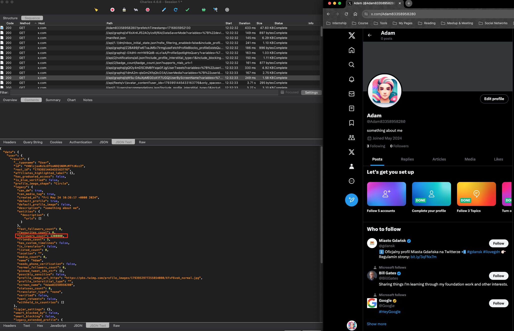
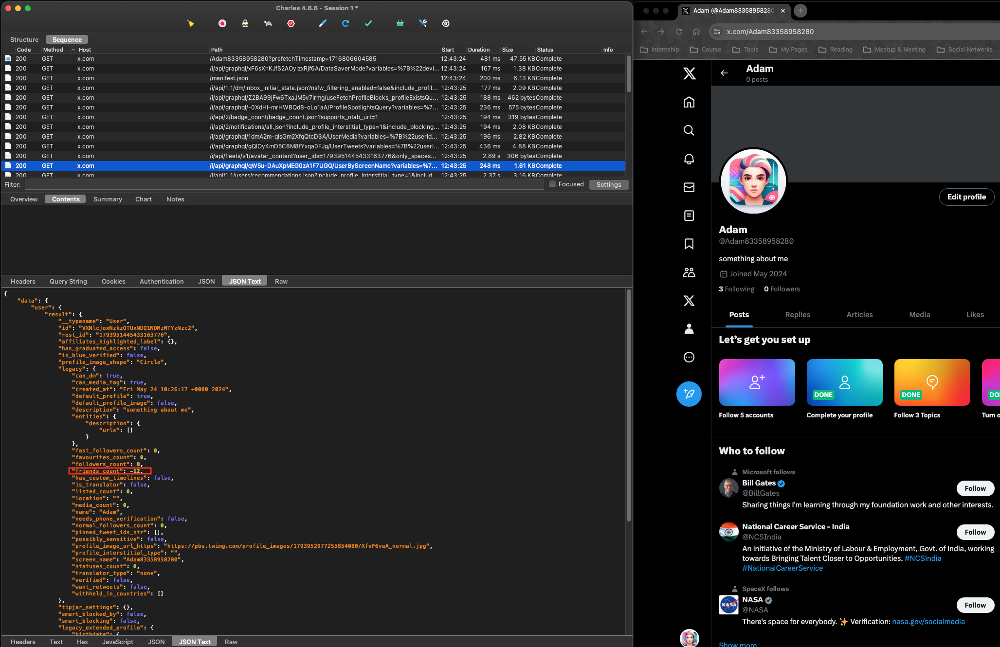
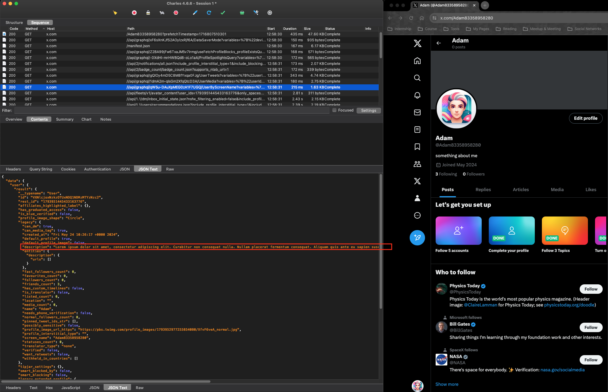
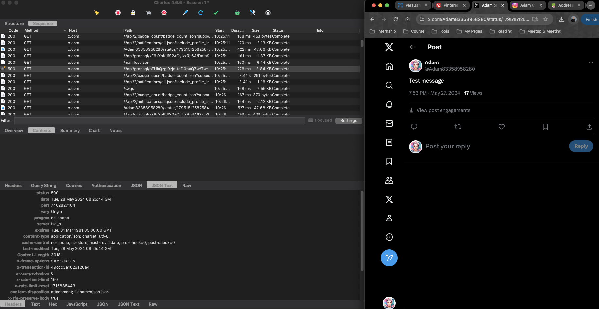
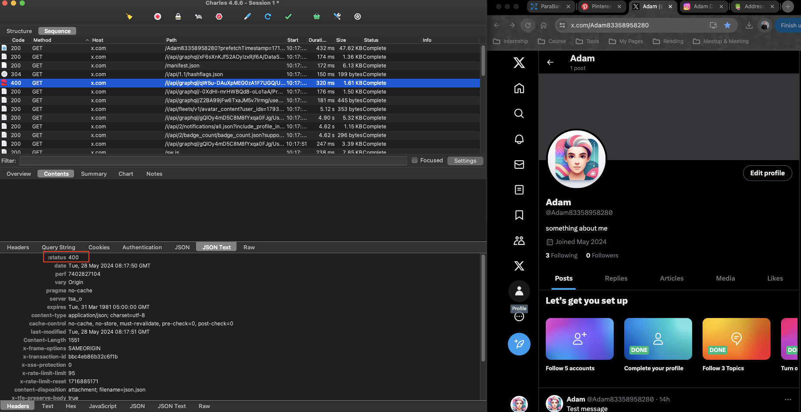
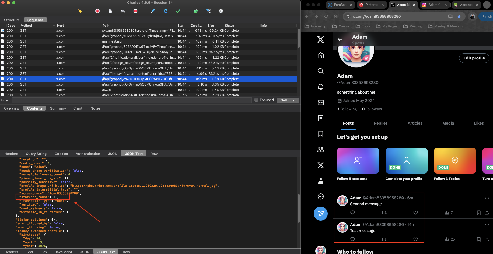
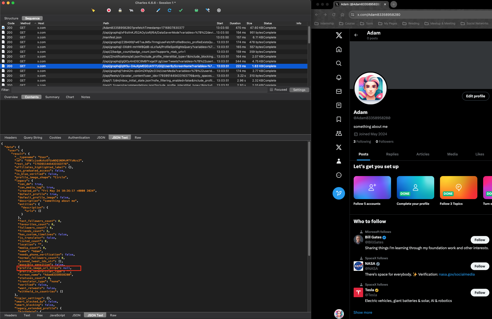

# Charles Proxy task: 

Pre-conditions
Set up charles proxy
You need an Twitter account for testing (create new or you can use your own). Please, use the web version.

*Attach the screenshots of each step.*

 

[Twitter account for testing](https://x.com/Adam83358958280)

## Do the following tasks using Map Local, Rewrite, breakpoints features in Charles:

 

> **The task was performed correctly by modifying the API response in Charles Proxy, but the changes are not visible on Twitter, likely due to additional security or caching mechanisms used by the platform.   Despite the correct settings and the SSL certificate installed, the requests on Instagram remain encrypted, making it impossible to modify them.** [Screenshot](img/Instagram.png)

  

### 1. Change the number of subscribers to 13 00000

 

### 2. Change the number of subscriptions for -12

 

### 3. Change the biography (Description) to text with 300 characters

 

### 4. Return 500 when opening a publication

 

### 5. Return 400 when opening profile page

 

### 6. Return 0 posts and check the text on the page

 

### 7. Delete your profile photo and check what present instead of photo

 

## Tutorials:

- [Getting Started With Using Charles Proxy For Testing](https://www.youtube.com/watch?v=lf2yCklqdyo&t=549s)
    - [Testing With Charles Proxy](https://nicolalindgren.com/testing-with-charles-proxy-part-1/)
- [How to Inspect All Network Traffic // Charles Proxy](https://www.youtube.com/watch?v=RwfeH5ahxCg)
- [Charles as a way to test web integrations](https://www.youtube.com/watch?v=v8RYWEUPSK8)
- [Manual QA: Testing for Beginners - Charles Proxy - Part 27](https://www.youtube.com/watch?v=tEvQg_mwlHk)
- [Charles Proxy Step by Step](https://www.youtube.com/watch?v=nEcz0Dw9IQI&list=PLNRoIKv4RbroQ51nSWoXKLHGMKjOqjrry)
- [Modifying response using Charles Proxy](https://www.youtube.com/watch?v=DWSGX5lsJxw)
- [How to edit / change request /response using Charles proxy](https://www.youtube.com/watch?v=vtlsTIBEi7s&t=336s)
- [Using Charles HTTP Proxy Server to Intercept HTTPS (SSL) Traffic](https://www.youtube.com/watch?v=AElqiF6VSZI)
- [Charles Proxy in iOS](https://www.youtube.com/watch?v=qp3Q3E_DSB4)
- [How do PROs make REWRITE in Charles Proxy](https://www.youtube.com/watch?v=YEY7Vdqjm_Q)
- [How to change the HTTP response code with Charles Proxy](https://www.youtube.com/watch?v=0228QtlCGY4)

## Issue with the Instagram:

- [Can't encrypt Instagram requests using Charles Proxy](https://stackoverflow.com/questions/60278132/cant-encrypt-instagram-requests-using-charles-proxy)
- [Using Charles Proxy I'm trying to change the number of followers an Instagram](https://stackoverflow.com/questions/78390094/using-charles-proxy-im-trying-to-change-the-number-of-followers-an-instagram-ac)
- [Issue reversing the Instagram apk with Charles and Mitmproxy](https://github.com/subzeroid/instagrapi/discussions/666)
- [Charles Proxy Instagram Requests](https://github.com/aliforever/charles-proxy-instagram-requests)
- [Reading Instagram Private API Requests with Charles Proxy](https://archive.ph/2022.10.13-160735/https://adw0rd.com/2020/03/26/sniffing-instagram-charles-proxy/en/#selection-227.0-227.57)
- [Instagram Graph API](https://developers.facebook.com/docs/instagram-api)
