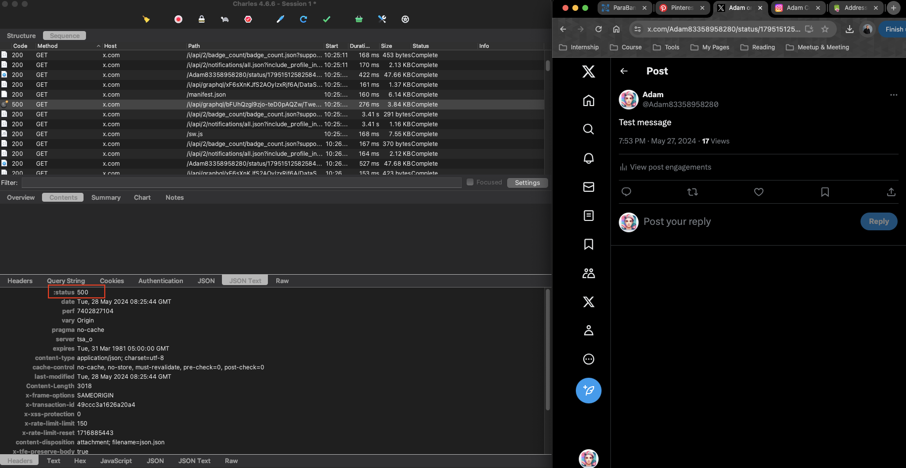

# Charles Proxy task: 

Pre-conditions
Set up charles proxy
You need an Instagram account for testing (create new or you can use your own). Please, use the web version.

*Attach the screenshots of each step.*

 

[Instagram account for testing](https://www.instagram.com/adamceg/)

## Do the following tasks using Map Local, Rewrite, breakpoints features in Charles:

### 1. Change the number of subscribers to 13 00000

### 2. Change the number of subscriptions for -12

### 3. Change the biography (Description) to text with 300 characters

### 4. Return 500 when opening a publication

### 5. Return 400 when opening profile page

### 6. Return 0 posts and check the text on the page

### 7. Delete your profile photo and check what present instead of photo

