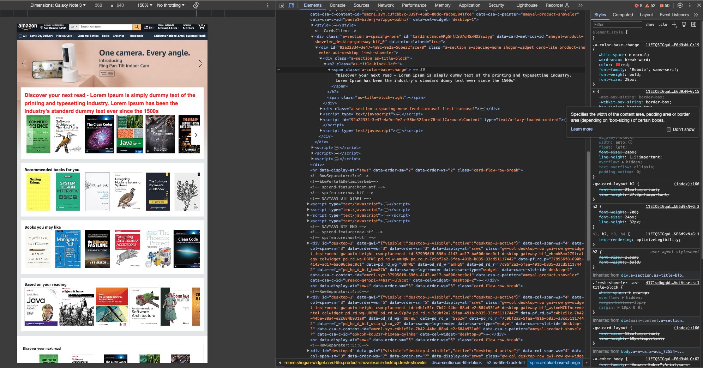

# Elements Tab

_1. Open the page https://www.amazon.com/_  
_2. Change a headline on the card to bigger one (more than 1 line text)_  
_3. Change the color and font (type, weight, size etc) for headlines_  
_4. Make an image size 2 times smaller._  
_5. Make a screenshot of the new page view on Galaxy Note 3_  

 

## [Solution](https://github.com/AdamCegGrid/practical_task_module_8/blob/main/DevTools_Task/img/01-Elements-Tab.png) 

 

