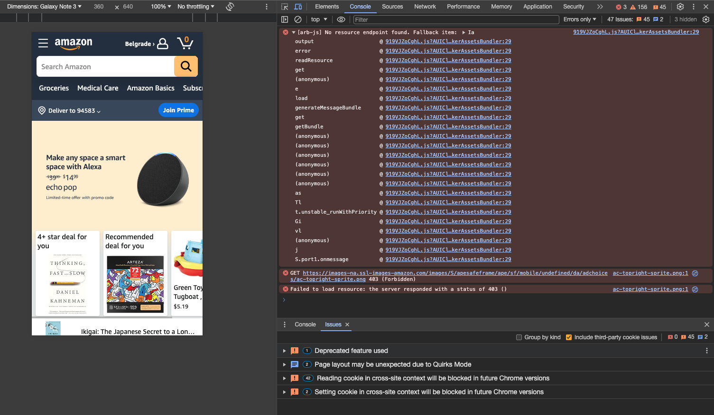

# Console Tab

_Filter Errors only in the console. Describe what you understand from each message. Attach the screenshot_  

 

- `[arb-js] No resource endpoint found. Fallback item: la`

It means that the program tried to access a certain resource that was not available or did not exist. Therefore, an alternative resource labeled “Ia” was used to ensure proper operation.

- `GET https://images-na.ssl-images-amazon.com/images/S/apesafeframe/ape/sf/mobile/undefined/da/adchoices/ac-topright-sprite.png 403`

An attempt to download an image from the specified URL failed because the server denied access to the resource, returning an HTTP 403 status. This means that the server recognized the request, but denied authorization to the resource.

- `Failed to load resource: the server responded with a status of 403`

Indicates that the server denied access to the resource that the web page was trying to access. A status of 403 indicates that the request was valid, but the server refused to authorize access. 

 

## [Solution](https://github.com/AdamCegGrid/practical_task_module_8/blob/main/DevTools_Task/img/03-Console-Tab.png) 

 

