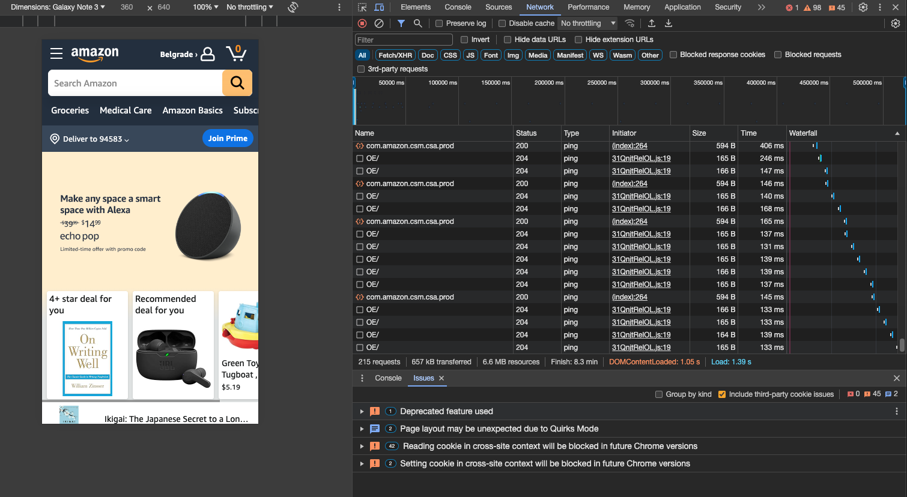
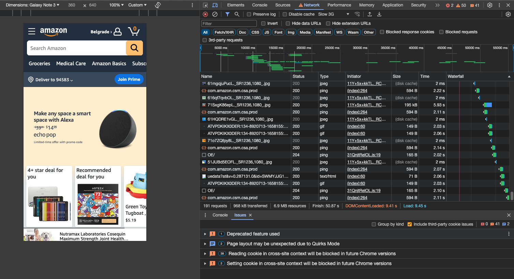

# Network Tab

_Compare the time DOMContentLoaded and Finish time for your usual internet connection and Slow 3G_  

 

Under the usual internet connection, the DOMContentLoaded event, which indicates when the HTML is fully parsed, occurs at 1.05 seconds. In contrast, when simulating a slow 3G connection, this event takes significantly longer, happening at 9.41 seconds, showing a substantial increase in loading time due to reduced network speed.

## [Simulate Usual Internet Connection:](https://github.com/AdamCegGrid/practical_task_module_8/blob/main/DevTools_Task/img/04-Network-Tab-IC.png) 

- DOMContentLoaded: `1.05 s`

 

 

## [Simulate Slow 3G Connection:](https://github.com/AdamCegGrid/practical_task_module_8/blob/main/DevTools_Task/img/04-Network-Tab-3g.png) 

DOMContentLoaded: `9.41 s`

 

