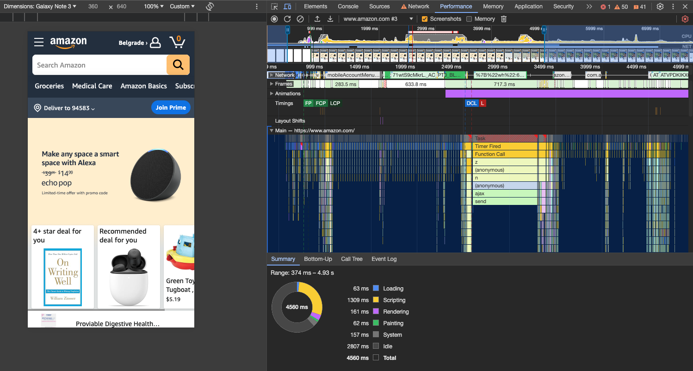

# Performance Tab

_Profile the page with Fast 3G connection. Analyze the results._  

 

### Performance results under Fast 3G conditions:

- **Loading**: `63 ms`  
- **Scripting**: `1309 ms`  
- **Rendering**: `161 ms`  
- **Painting**: `62 ms`  
- **System**: `157 ms`  
- **Idle**: `2807 ms`  
- **Total**: `4560 ms`  

 

The performance analysis under a Fast 3G connection shows that Scripting at 1309 ms is the primary contributor to delays, suggesting that JavaScript optimizations could significantly enhance performance. Although Rendering and Painting are moderately efficient, further improvements could be made to streamline these processes. A notable Idle time of 2807 ms indicates excessive waiting, highlighting an opportunity to optimize asynchronous operations or task management to reduce overall page load time, which totals 4560 ms.

## [Solution](https://github.com/AdamCegGrid/practical_task_module_8/blob/main/Performance_Task/img/05-Performance-Tab.png) 

 

