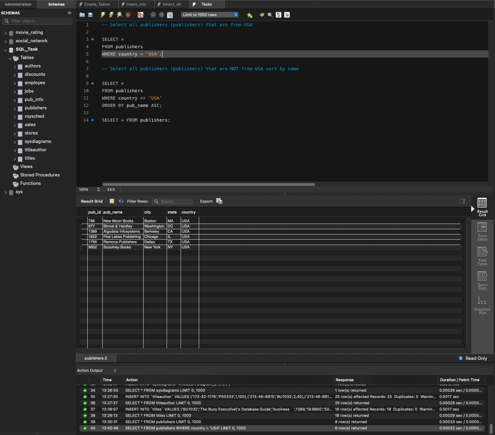
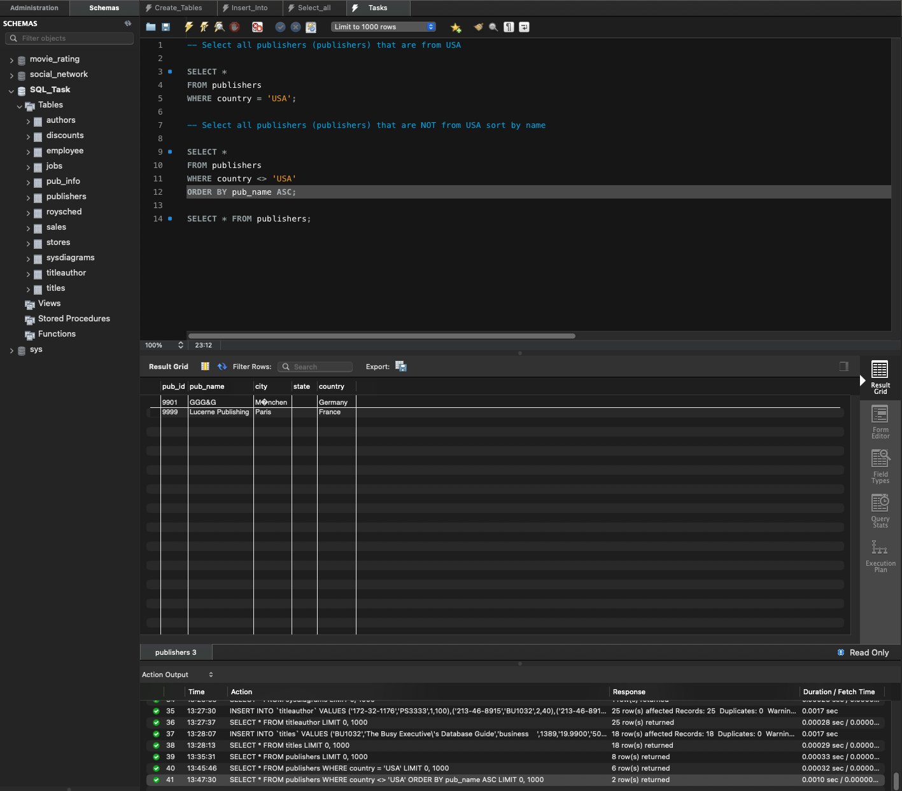

# SQL task:

1. Download DB and pdf schema
2. Prepare query for:
    - Select all publishers (publishers) that are from USA
    - Select all publishers (publishers) that are NOT from USA sort by name

<sub>*Attach requests for queries and screenshots with results*</sub>

### Select all publishers (publishers) that are from USA

```sql
SELECT *
FROM publishers
WHERE country = 'USA';
```



### Select all publishers (publishers) that are NOT from USA sort by name

```sql
SELECT *
FROM publishers
WHERE country <> 'USA'
ORDER BY pub_name ASC;
```



<br>

## Tutorials:

- [MySQL Tutorial for Beginners](https://www.youtube.com/watch?v=7S_tz1z_5bA)
- [Learn SQL In 60 Minutes](https://www.youtube.com/watch?v=p3qvj9hO_Bo)
- [SQL for Beginners](https://www.youtube.com/watch?v=wifRYaPiiM0&list=PLUDwpEzHYYLvWEwDxZViN1shP-pGyZdtT&index=1)
- [Kurs MySQL- pl](https://www.youtube.com/watch?v=99JAI24Zd24&list=PLOYHgt8dIdoymv-Wzvs8M-OsKFD31VTVZ)